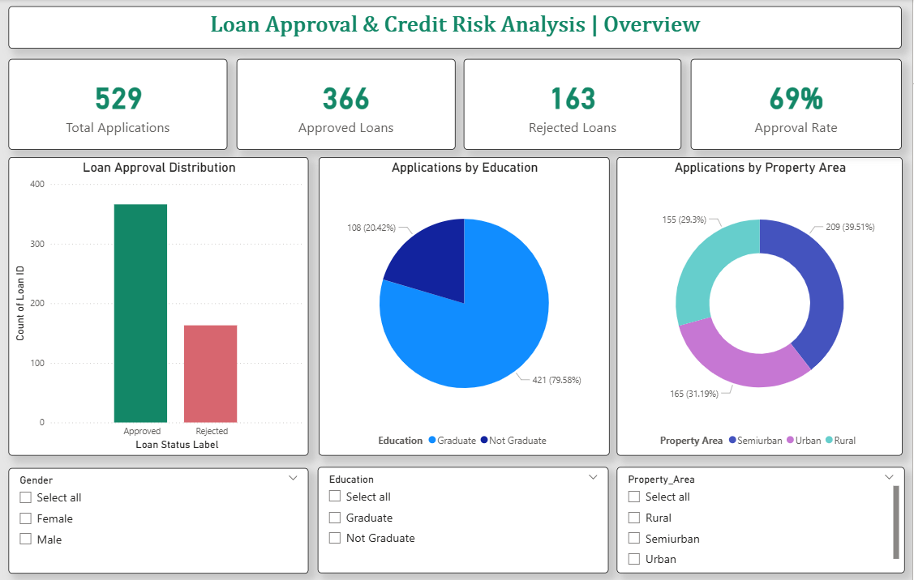
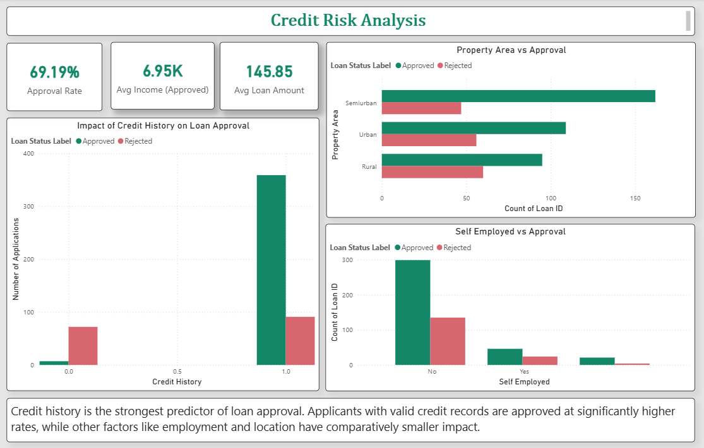
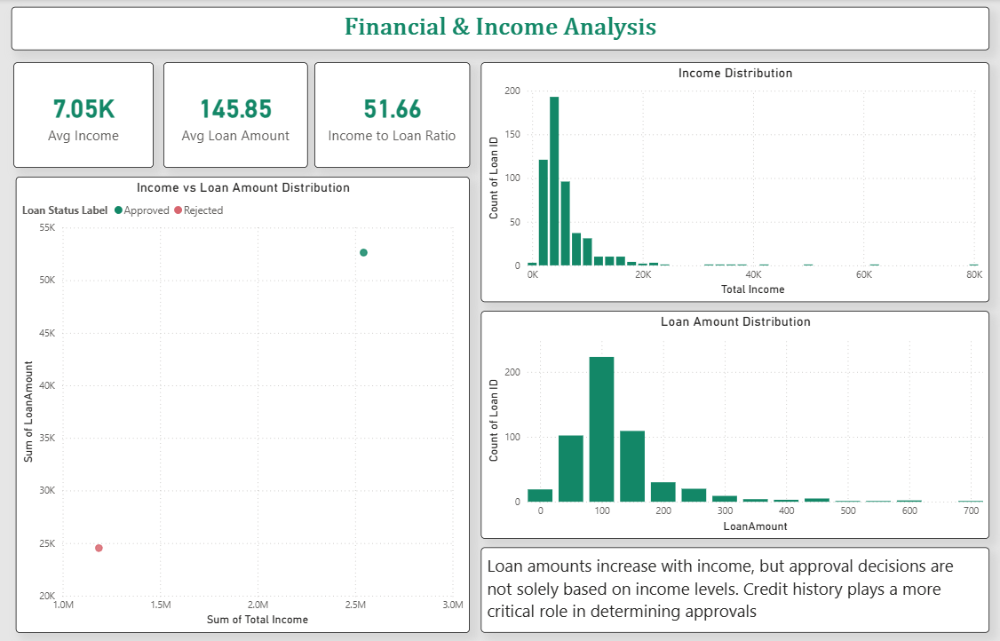

# 🏦 Loan Approval & Credit Risk Analysis

## 📌 Project Overview

This project analyzes loan application data to understand approval patterns and identify key factors influencing loan decisions. The goal is to provide actionable insights for financial institutions to improve credit risk assessment.

## 🎯 Objectives

* Analyze loan approval vs rejection trends
* Identify key factors affecting loan approval
* Understand the impact of credit history, income, and demographics
* Build an interactive dashboard for decision-making

## 🛠️ Tools & Technologies

* **MySQL** – Data cleaning & transformation
* **Power BI** – Data visualization & dashboarding
* **Excel** – Initial data handling

## 🔍 Key Insights

### 1. Credit History is the Most Important Factor

Applicants with valid credit history have significantly higher approval rates compared to those without.

### 2. Income Alone Does Not Guarantee Approval

Although higher income is associated with higher loan amounts, approval decisions depend more on credit behavior.

### 3. Property Area Influence

Semi-urban and urban applicants show higher approval rates compared to rural areas.

### 4. Employment Status Impact

Non-self-employed applicants have slightly higher approval rates.

## 📊 Dashboard Features

### 📄 Page 1: Overview

* Total applications, approvals, rejections, and approval rate
* Distribution by education and property area
* Interactive filters

### 📄 Page 2: Credit Risk Analysis

* Impact of credit history on approvals
* Property area and employment analysis
* Key business insights

### 📄 Page 3: Financial & Income Analysis

* Income and loan amount distribution
* Income vs loan scatter analysis
* Financial behavior insights

## 📈 Business Impact

* Helps financial institutions identify high-risk applicants
* Supports data-driven loan approval decisions
* Improves understanding of customer financial behavior

